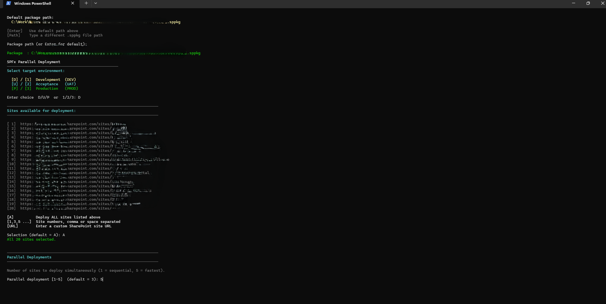
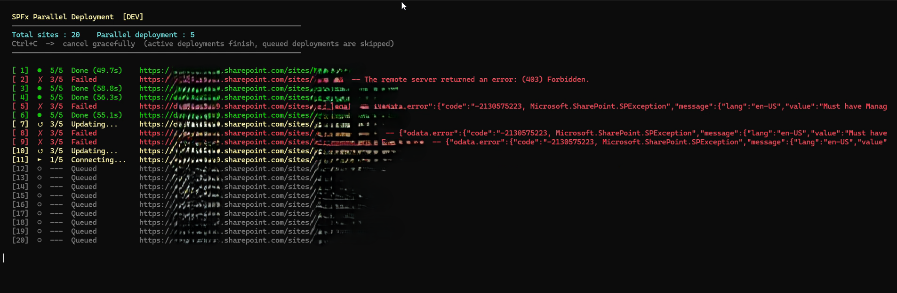

# SPFx Parallel Deployment Tool

A PowerShell 5.1 script that deploys SharePoint Framework (SPFx) `.sppkg` solutions to **multiple site collection app catalogs in parallel**, with a live console dashboard, structured logging, and graceful cancellation.

---

## Screenshots

### Environment & Package Selection


### Live Deployment Dashboard


### Deployment Summary


> **To add screenshots:** Run the script, take screenshots of each stage, save them to the `screenshots/` folder using the names above.

---

## Features

- **Parallel deployments** — deploy to 1–5 sites simultaneously (configurable at runtime)
- **Smart install/update** — checks the site app catalog list to determine whether to install fresh or upgrade an existing app
- **Live dashboard** — in-place console rows show each site's current step in real time
- **Graceful Ctrl+C** — active deployments finish cleanly; queued sites are cancelled
- **Structured logging** — every run writes a timestamped `.log` file with per-site GUIDs for cross-run correlation
- **Multi-environment** — DEV / UAT / PROD environment files with independent site lists
- **Selective deployment** — deploy all sites, pick by number, or enter a custom URL at runtime

---

## Prerequisites

| Requirement | Details |
|---|---|
| **Windows PowerShell 5.1** | Must run in WPS 5.1, **not** PowerShell 7+ |
| **PnP PowerShell (legacy)** | `SharePointPnPPowerShellOnline` module |
| **SharePoint permissions** | Site Collection Administrator on each target site |
| **Site Collection App Catalog** | Must be enabled on each site |

### Install the PnP module (once)

```powershell
# Run in Windows PowerShell 5.1
Install-Module SharePointPnPPowerShellOnline -Scope CurrentUser -Force
```

---

## Project Structure

```
Deploy-SPFx-Solution.ps1       ← Entry point — run this
├── modules/
│   ├── Icons.ps1              ← Unicode/ASCII icons & phase icon map
│   ├── Display.ps1            ← Live dashboard, Write-Log, Invoke-DrainJob
│   ├── Logging.ps1            ← Structured log writer & run summary
│   ├── ScriptBlock.ps1        ← Per-site job worker (runs in background jobs)
│   ├── SetEnvironment.ps1     ← Interactive environment + site selector
│   └── SolutionPath.ps1       ← Interactive .sppkg path selector
├── environments/
│   ├── DEV.ps1                ← DEV site collection list
│   ├── UAT.ps1                ← UAT site collection list
│   └── Prod.ps1               ← Production site collection list
├── deploy-logs/               ← Auto-created; one .log file per run
└── screenshots/               ← Add your own screenshots here
```

---

## Setup

### 1. Configure your site collections

Edit the environment files to add your SharePoint tenant and site collection URLs:

**`environments/DEV.ps1`**
```powershell
$environmentName = 'DEV'
$siteCollections = @(
    'https://YOUR-TENANT-dev.sharepoint.com/sites/YourApp-Dev',
    'https://YOUR-TENANT-dev.sharepoint.com/sites/DEV_Department1',
    # ...
)
```

Repeat for `UAT.ps1` and `Prod.ps1`.

### 2. Set the default package path

Open `Deploy-SPFx-Solution.ps1` and update the default path:

```powershell
$packagePath = 'C:\Path\To\Your\Solution\your-solution.sppkg'
```

You can also override this at runtime when prompted.

---

## Usage

Open **Windows PowerShell 5.1** and run:

```powershell
.\Deploy-SPFx-Solution.ps1
```

The script will interactively prompt for:

1. **Package path** — confirm the default `.sppkg` path or enter a new one
2. **Environment** — `D` DEV / `U` UAT / `P` PROD
3. **Site selection** — `A` for all, specific numbers (`1,3,5`), or a custom URL
4. **Parallel jobs** — how many sites to deploy simultaneously (1–5)

### Example session

```
  Package to Deploy
  ──────────────────────────────────────────────────────────────────────
  Default package path:
    C:\Path\To\Your\Solution\your-solution.sppkg

  Package path (or Enter for default):

  Select target environment:
    [D] / [1]  Development  (DEV)
    [U] / [2]  Acceptance   (UAT)
    [P] / [3]  Production   (PROD)

  Enter choice  D/U/P  or  1/2/3: D

  Sites available for deployment:
  [ 1]  https://YOUR-TENANT-dev.sharepoint.com/sites/YourApp-Dev
  [ 2]  https://YOUR-TENANT-dev.sharepoint.com/sites/DEV_Department1
  ...

  Selection (default = A): A

  Parallel deployment [1-5]  (default = 3): 3
```

---

## Deployment Steps (per site)

Each background job runs these steps and reports progress to the dashboard in real time:

| Step | Phase | Description |
|------|-------|-------------|
| 1 | Connecting | `Connect-PnPOnline` with Web Login |
| 2 | Checking | Query `Apps for SharePoint` list to detect existing install |
| 3 | Updating / Installing | `Add-PnPApp -Overwrite` (update) or `Add-PnPApp -Publish -SkipFeatureDeployment` (new) |
| 4 | Publishing | `Publish-PnPApp` (when applicable) |
| 5 | Done | Reports elapsed time |

---

## Log Files

Each run creates a log in `deploy-logs/`:

```
Deploy_your-solution_[DEV]_20260331_143022.log
```

Log format:
```
[2026-03-31 14:30:22] [RUN:<guid>] [Thread_ID:<guid>] [INFO    ] [3/5] Publishing  https://...
[2026-03-31 14:30:25] [RUN:<guid>] [Thread_ID:<guid>] [SUCCESS ] [5/5] Done (12.3s)  https://...
```

Logs are excluded from git via `.gitignore`.

---

## Cancellation

Press **Ctrl+C** during a run to cancel gracefully:
- Currently active deployments **complete normally**
- Queued (not yet started) sites are **marked Cancelled** and skipped
- The summary and log still report partial results

---

## Contributing

1. Fork the repository
2. Create a feature branch: `git checkout -b feature/my-improvement`
3. Commit your changes: `git commit -m "Add: my improvement"`
4. Push and open a Pull Request

---

## License

MIT License — free to use, modify, and distribute.
